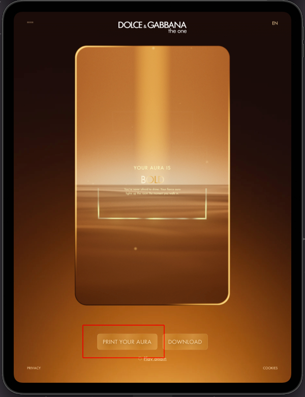

# Guida Tecnica Installazione e Debug - D&G The One Experience

Questo documento guida nell'installazione dell'ambiente, l'avvio del progetto e il debug del problema di stampa con la stampante DNP QW410 su iOS.

## 1. Prerequisiti

Assicurarsi di avere installato:
- **Node.js** (versione 18+ raccomandata, verificare con `node -v`)
- **PNPM** (gestore pacchetti utilizzato)
- **Xcode** (necessario per buildare su iOS/iPadOS)
- **CocoaPods** (gestore dipendenze iOS)

### Installazione Strumenti Globali (se mancanti)
```bash
# Installazione PNPM (se non presente)
npm install -g pnpm

# Installazione CocoaPods (se non presente)
sudo gem install cocoapods
# Se si usa un Mac con Apple Silicon e problemi con gem:
brew install cocoapods
```

## 2. Setup del Progetto

1.  **Clonare il repository:**
    ```bash
    git clone https://gitlab.com/mirror-production/customers/dng/dng-the-one/dng-the-one-web.git
    cd dgb-the-one-website
    git checkout feature/add-capacitor-support
    ```

2.  **Installare le dipendenze:**
    ```bash
    pnpm install
    ```

3.  **Setup variabili d'ambiente:**
    Copiare il file `.env.example` in `.env`.
    Per il debug della stampa, assicurarsi che nel `.env` ci sia:
    ```env
    # Impostare a false per testare la stampa diretta via plugin (non AirPrint nativo)
    USE_NATIVE_PICKER=false
    
    # Nome (o parte del nome) della stampante da cercare (default: cerca tutte)
    # Utile se ci sono più stampanti nella rete e si vuole targettizzarne una specifica
    PRINTER_NAME=QW410
    ```

## 3. Avvio in Sviluppo (Browser)

Per verificare che l'app funzioni lato web:
```bash
pnpm dev
```
L'app sarà accessibile a `http://localhost:3000`.
*Nota: La funzionalità di stampa nativa e discovery stampanti NON funziona nel browser.*

## 4. Build e Sync per iOS (Capacitor)

Per testare su dispositivo/simulatore iOS si può usare il comando unificato:

```bash
pnpm ios
```

Questo comando esegue in sequenza:
1.  Build/Generate del progetto web (`pnpm generate`)
2.  Copia dei file nella cartella iOS (`npx cap sync`)
3.  Apertura di Xcode (`npx cap open ios`)

In alternativa, per eseguire i passaggi manualmente:

1.  **Build del progetto web (Nuxt):**
    ```bash
    pnpm generate
    ```

2.  **Sincronizzare con iOS:**
    Questo comando copia i file di build (`dist/`) nella cartella nativa iOS e aggiorna i plugin.
    ```bash
    npx cap sync ios
    ```

## 5. Esecuzione su iOS

1.  **Aprire il progetto in Xcode:**
    ```bash
    npx cap open ios
    ```

2.  **Configurazione Signing (Prima volta):**
    - In Xcode, cliccare sul progetto `App` nella barra laterale sinistra.
    - Andare nel tab **Signing & Capabilities**.
    - Selezionare un **Team** valido.
    - Assicurarsi che il **Bundle Identifier** sia univoco se non si riesce a firmare quello esistente.

3.  **Eseguire su Dispositivo Reale (iPad):**
    - Collegare l'iPad via USB.
    - Selezionare l'iPad come target in alto a sinistra in Xcode.
    - Premere il tasto **Play** (o `Cmd + R`).


## 6. Debug del Problema di Stampa

### Il Problema Attuale
L'app deve stampare una "cartolina" generata dinamicamente sulla stampante **DNP QW410**.
Attualmente la stampa fallisce con errore `INVALID` perché la stampante non è certificata AirPrint e il plugin standard (`cordova-plugin-printer`) si appoggia alle API AirPrint di iOS.

### Dove guardare nel codice
Il file principale è `components/Experience/End.vue`.

**Funzioni chiave:**
- `startPrinterDiscovery()`: Usa `capacitor-zeroconf` per trovare stampanti sulla rete (cerca servizi `_ipp._tcp`).
- `upsertPrinterFromService()`: Costruisce l'URL IPP della stampante (es. `ipp://192.168.1.x:631/printers/QW410...`).
- `handlePrint()`: Gestisce il click sul pulsante stampa.
    - Cattura lo screenshot del canvas.
    - Genera un payload base64.
    - Chiama `window.cordova.plugins.printer.print()` passando l'URL IPP scoperto.

### Log e Diagnostica
Aprire la console di debug in Xcode (in basso) mentre l'app gira sull'iPad.

Si dovrebbero vedere log simili a questi:
```
[ZeroConf] Discovered printer service: ...
[Print] Sending to printer: QW410...
[Print] Printer URL: ipp://192.168.1.113:631/printers/QW410-1-4x6
To Native Cordova -> Printer print INVALID ...
```

### Obiettivo Tecnico
Sostituire l'uso di `cordova-plugin-printer` con una soluzione custom (plugin Capacitor o Cordova) che permetta di:
1.  Aprire un socket TCP diretto verso la stampante (porta **9100** per RAW o **631** per IPP).
2.  Inviare i dati grezzi dell'immagine (o un payload IPP valido) senza passare per il framework `UIPrintInteractionController` di iOS.
3.  Gestire manualmente la comunicazione di rete (poiché `fetch()` da WebView verso IP locali è bloccato da iOS/CORS).

## 7. Workflow dell'App (Come testare)

Per arrivare alla schermata di stampa e riprodurre il bug:

1.  **Schermata Iniziale:** Inserire un nome qualsiasi nel campo di testo e proseguire.
2.  **Quiz (Step 1-3):** Rispondere alle 3 domande successive selezionando un'opzione qualsiasi (ruotando, swipando o trascinando).
3.  **Animazione Finale:** Attendere il completamento dell'animazione ("Unveiling your Aura").
4.  **Schermata Risultati (End):** Tenere premuto quando indicato, apparirà la card finale con il risultato (es. "BOLD").
    - In basso appariranno due pulsanti: **PRINT YOUR AURA** e **DOWNLOAD**.
    - Premere **PRINT YOUR AURA** per avviare il processo di stampa e vedere i log di errore.



## 8. Comandi Utili

- **Ricostruire e aggiornare iOS dopo modifiche JS/Vue:**
  Uso del comando unificato (consigliato):
  ```bash
  pnpm ios
  ```
  Oppure manualmente:
  ```bash
  pnpm generate && npx cap sync ios
  ```
  Poi ri-eseguire da Xcode.

- **Verificare permessi iOS:**
  Se la discovery non funziona, controlla che nel file `ios/App/App/Info.plist` siano presenti le chiavi per `NSLocalNetworkUsageDescription` e i servizi Bonjour (`_ipp._tcp`, ecc.).

